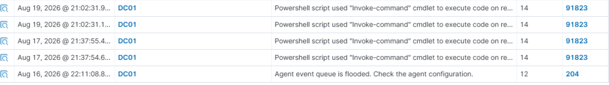
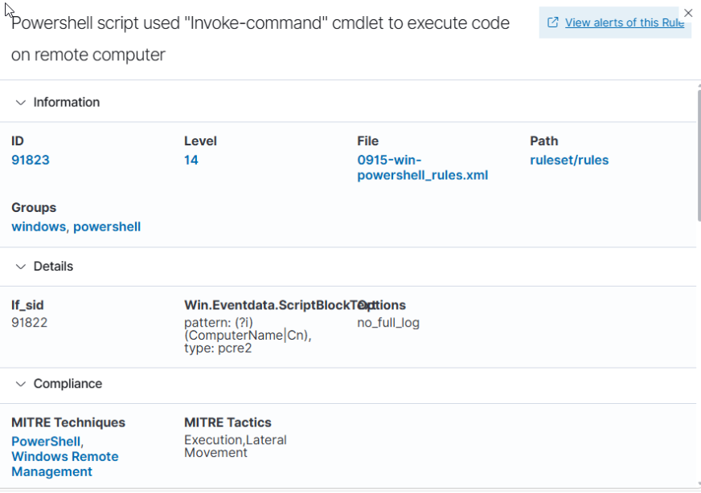
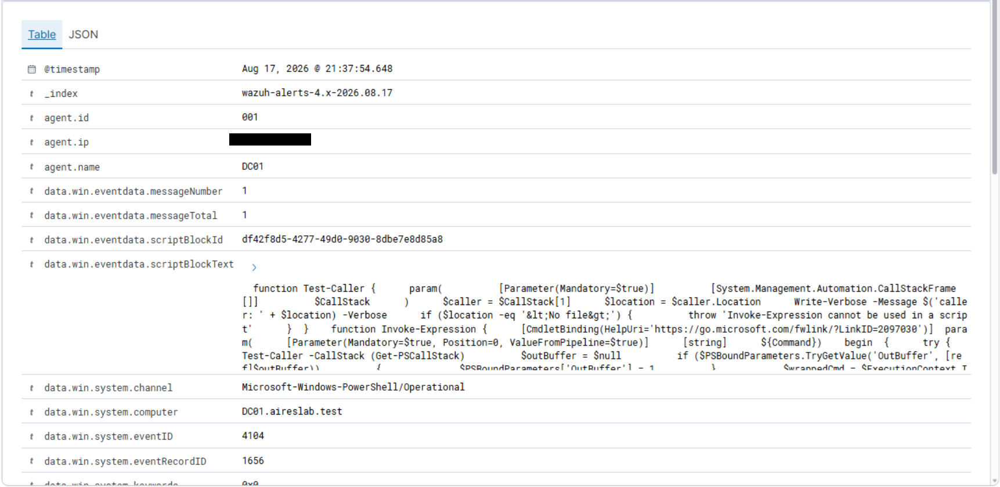
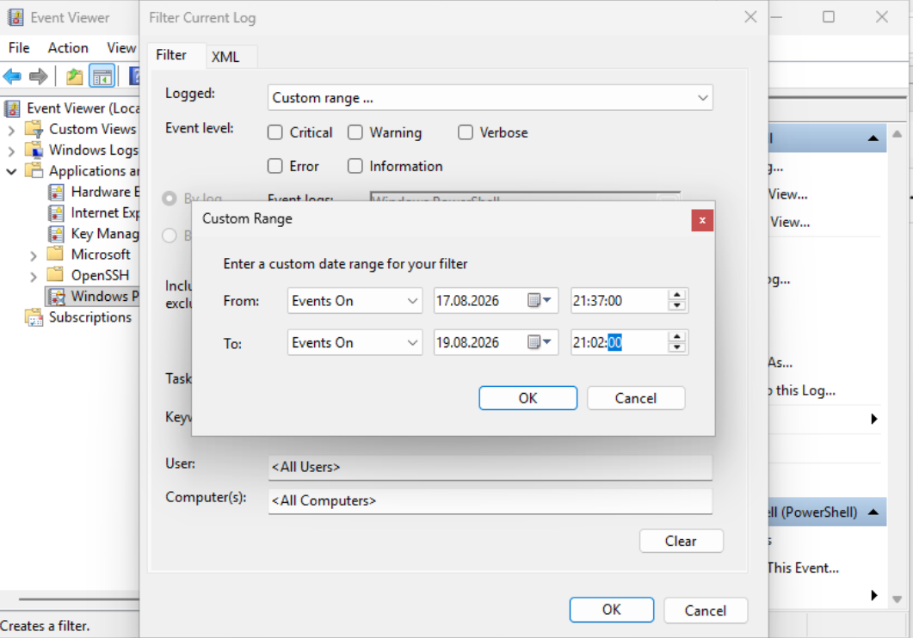
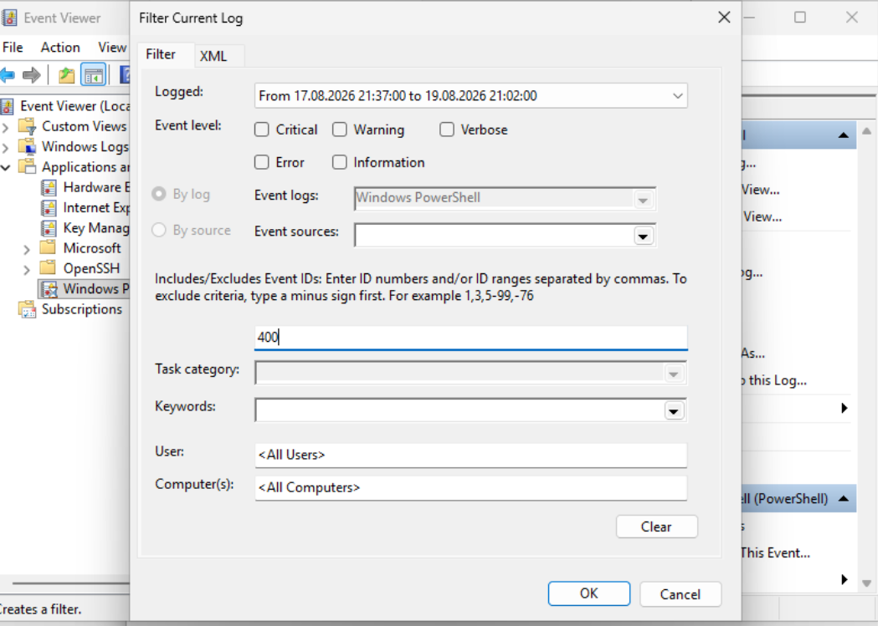
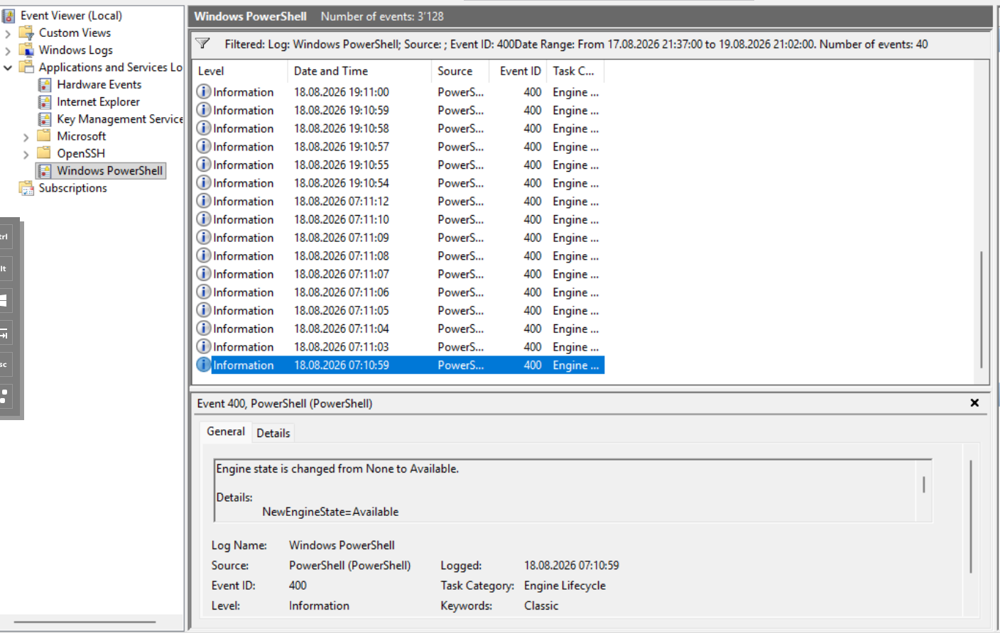

# PowerShell "Invoke-Command" Alert: False Positive Triage

**Date:** 2026-08
**Environment:** aireslab.test (Proxmox homelab)
**Technique / Area:** PowerShell / Lateral Movement (alert triage, not a simulated attack)
**MITRE ATT&CK:** T1059.001 PowerShell, T1021.006 Windows Remote Management (as tagged by the rule; final assessment below is false positive)

## Scenario

Five alerts showed up on `DC01`: four hits on rule `91823` ("Powershell script used 'Invoke-Command' cmdlet to execute code on remote computer", level 14, high severity, tagged Execution / Lateral Movement) and one hit on rule `204` ("Agent event queue is flooded"). A level-14 alert tagged with a lateral-movement technique is exactly the kind of thing that shouldn't be dismissed just because it's in my own lab, so instead of assuming it was me, I triaged it properly.



## Environment

| Component | Detail |
|---|---|
| Alerting host | DC01 (aireslab.test domain controller) |
| SIEM | Wazuh |
| Triggering rule | 91823, level 14, groups: windows, powershell |
| Related rule | 204, level 12 ("Agent event queue is flooded") |
| Data source | PowerShell Script Block Logging (Event ID 4104) via Wazuh agent |

## Steps Performed

1. Reviewed the alert list, 4x rule `91823` in two near-duplicate timestamp pairs (Aug 17 ~21:37, Aug 19 ~21:02), plus 1x rule `204` around the same period.
2. Opened the rule definition for `91823` instead of assuming what it detects.
3. Found the actual decoder logic: a regex match on `Win.Eventdata.ScriptBlockText` for the pattern `(?i)(ComputerName|Cn)`, a simple case-insensitive substring/regex match, not a check for an actual established remote session.
4. Pulled the real triggering event and read the full captured `ScriptBlockText`.
5. Tried to identify the source of the module (see Source Investigation below): searched `$env:PSModulePath` and common temp locations for the file, checked for a correlated Event ID 4103 at the same timestamp, and checked Event ID 400 in the classic `Windows PowerShell` log.

## Detection

**Rule 91823 decoder logic:**

```text
if_sid: 91822
field: Win.Eventdata.ScriptBlockText
pattern: (?i)(ComputerName|Cn)
type: pcre2
```



**What the actual captured script block contained:** a PowerShell module defining *proxy/wrapper functions* for `Invoke-Expression` and `Invoke-Command` (confirmed by `Export-ModuleMember -Function @('Invoke-Expression','Invoke-Command')` at the end of the block). The wrapper calls a `Test-Caller` function that inspects `Get-PSCallStack` and throws if `Invoke-Expression` is called from an interactive/no-file context, a restrictive pattern consistent with shell hardening, not an attempt to hide or enable malicious execution.

Because the `Invoke-Command` proxy has to faithfully mirror the real cmdlet's parameter block to stay a transparent wrapper, it redeclares `${ComputerName}` with `[Alias('Cn')]` as part of its `param()` block, plain parameter *declaration* text, not an actual invocation against a remote host.

Raw event, confirming the field the rule matched on and the full captured script block (`agent.ip` redacted before publishing):



## Analysis

The rule fired on the presence of the substring `"ComputerName"` (and alias `"Cn"`) inside a **function definition**, not because `Invoke-Command` was actually run against a remote target. A regex this broad can't distinguish between:

```text
Invoke-Command -ComputerName Server02 -ScriptBlock {...}   <- real remote execution
```

and

```text
param([Alias('Cn')][string[]] ${ComputerName})              <- parameter declaration inside a wrapper function
```

Both contain the literal text the rule is looking for; only one of them is actually lateral movement. No PSSession was established, no remote host was targeted, the entire event is one host (`DC01`) logging its own script block.

The `204` "agent event queue is flooded" alert lines up with the same window, consistent with a burst of script-block-logging events firing in quick succession (the near-duplicate timestamp pairs) rather than a separate issue.

**Verdict: false positive, for this specific alert match.** The rule fired on parameter-declaration text, not an actual remote invocation, that's confirmed directly from the captured script block content, independent of where the script came from.

## Source Investigation (Inconclusive)

I tried to identify what actually loaded this module onto `DC01`, working through every log-based avenue available in the current environment:

| Check | Result |
|---|---|
| Search `$env:PSModulePath` for a `.psm1`/`.ps1` containing the wrapper code | No match |
| Search common implicit-remoting temp locations (`%TEMP%`, `C:\Windows\Temp`) | No match |
| Correlate a same-timestamp Event ID 4103 (Module Logging / command invocation) | No matching event at either timestamp, found an unrelated 4103 event (a `secpol.cfg` password-policy read via `Get-Content`/`Select-String`) at a different hour, which turned out to be a separate, unrelated piece of activity, not connected to this alert |
| Correlate Event ID 400 ("Engine state is changed") in the classic `Windows PowerShell` log | No entries covering either timestamp, the log's retained range doesn't reach back that far |

Filter used for the Event ID 400 correlation check, scoped to the exact window between the two alert timestamps:




Result: 40 events in that window, all clustered on Aug 18, none landing on either actual alert timestamp (Aug 17 21:37:54 or Aug 19 21:02:31):



None of these turned up a source. That's a real technical finding in its own right: **Event ID 4104 (Script Block Logging) fires when PowerShell *parses* a block of code, including simply defining functions during a module import, regardless of whether that code is ever invoked.** The complete absence of a corresponding 4103 event strongly suggests the proxy functions were only *defined* (e.g. a module got imported) and never actually *called* with a real remote target, which is an even stronger basis for "false positive" than the script-block content alone.

**What remains genuinely unresolved:** which module, script, or tool caused that import in the first place. I'm treating that as closed for now, not because it's answered, but because I've exhausted the reasonable avenues available with the current logging setup. Windows PowerShell's own logs don't retain process/parent-process context the way something like Sysmon would (Event ID 1, with full command line and parent process chain), this is a concrete case for prioritizing the Sysmon deployment already on the roadmap, since it would have made this question trivial to answer instead of untraceable.

## Lessons Learned

- A rule's severity level and MITRE tags describe what the rule is *trying* to detect, not proof that a match is a true instance of that technique, the decoder logic underneath determines what will actually make it fire.
- Substring/regex-based detections on script block text are inherently prone to false positives when the pattern can appear in both an attacker's command and an unrelated function/parameter definition.
- "I think this is benign" and "I confirmed this is benign, here's the evidence" are different claims. The second one requires pulling the raw event and the rule logic, not just the alert summary.
- Distinguishing a **true positive, benign** (the technique really happened, but it was authorized) from a **false positive** (the rule matched something that wasn't the technique at all) is a real triage skill, not just a severity judgment call.
- Clearing an alert's detection logic doesn't automatically clear the underlying activity. I could fully explain *why the rule fired* without knowing *why the script exists on a domain controller in the first place*, those are two separate questions, and it would have been easy to conflate "the match is a false positive" with "there's nothing here worth following up on."
- Not every investigation resolves completely, and that's fine as long as the stopping point is honest. I traced this through every log-based avenue the current setup supports and hit a real limit (log retention, no process-level telemetry) rather than stopping early, "inconclusive, here's exactly what I checked" is a legitimate and more credible outcome than forcing a definitive answer I didn't actually have.
- This is a concrete illustration of *why* process-level telemetry (Sysmon) matters beyond what PowerShell's own logging provides, Windows PowerShell logging tells you what code ran, but not reliably what launched it or from where.

## Next Steps

- Deploy Sysmon (already on the roadmap), Event ID 1 process creation logging, with full command line and parent process chain, would make this exact question trivially answerable next time instead of untraceable.
- Once Sysmon is in place, re-check whether this module still loads periodically on `DC01`, and use the process chain to identify the actual source.
- Consider a rule exception/tuning change so this specific proxy-module pattern (script blocks containing `Export-ModuleMember` alongside `ComputerName`) doesn't keep generating level-14 alerts on `DC01`, but only after the source is confirmed benign via Sysmon, not before.
- A more precise custom rule could require the pattern to appear as part of an actual cmdlet invocation syntax (e.g. `Invoke-Command\s+.*-ComputerName\s+\S+`) rather than anywhere in the script block, to cut down this class of false positive without losing real detections.
