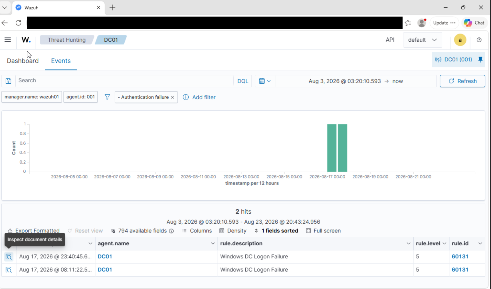

# Windows Failed Logon Detection – Validating the Endpoint-to-SIEM Pipeline

**Date:** 2026-08
**Environment:** aireslab.test (Proxmox homelab)
**Technique / Area:** Authentication / Credential Access
**MITRE ATT&CK:** T1110 – Brute Force (single deliberate failed attempt, not a full brute-force run — see Next Steps)

## Scenario

Both endpoints (`WIN11-01` and the Ubuntu Server) were showing as active in Wazuh, but an "active" agent isn't proof the SIEM is actually receiving useful security telemetry. I wanted a concrete, repeatable test that would let me trace one action on an endpoint all the way through to an alert in the dashboard, so I deliberately entered an incorrect password on the domain-joined Windows 11 client (`WIN11-01`) while authenticating against `DC01`.

## Environment

| Component | Detail |
|---|---|
| Source endpoint | WIN11-01 (Windows 11, domain-joined) |
| Domain controller | DC01 (aireslab.test) |
| SIEM | Wazuh |
| Data source | Windows Security event log via Wazuh agent |

## Steps Performed

1. Logged out of the domain session on WIN11-01.
2. Attempted to authenticate with a deliberately incorrect password against the `aireslab.test` domain.
3. Confirmed the failed attempt locally (logon rejected on the client).
4. Switched to the Wazuh dashboard and searched for events from WIN11-01 in the relevant time window.
5. Verified the failed logon appeared as a Windows Security alert.

## Detection

Wazuh generated a logon-failure alert from the Windows Security event log showing an unknown user / bad password condition, tied to WIN11-01 as the source.

> **TODO (before publishing):** replace this with the real artifacts —
> - Screenshot of the alert in the Wazuh dashboard → save as `screenshots/wazuh-failed-logon-alert.png` and embed it below.
> - The actual Wazuh rule ID and rule description (visible in the alert detail pane).
> - A redacted excerpt of the raw log (strip hostnames/IPs you don't want public).

```text
<!-- TODO: paste the real rule ID + short rule description here, e.g.
Rule ID: 60122
Description: Windows Logon Failure - Unknown user or bad password
Level: 5
-->
```



## Analysis

This gave a simple but complete end-to-end trace:

```text
Deliberate bad-password logon on WIN11-01
      |
      v
Windows Security event (logon failure) written locally
      |
      v
Wazuh agent forwards the event
      |
      v
Wazuh rule matches and fires an alert
      |
      v
Alert visible and searchable in the Wazuh dashboard
```

The value here wasn't the individual alert — a single bad password isn't an attack — it was proving that every link in the pipeline (event generation, agent forwarding, rule matching, dashboard visibility) actually works. That's a prerequisite for trusting any later, more realistic detection scenario in this lab.

## Lessons Learned

- An agent showing "active" in Wazuh only confirms connectivity, not that useful telemetry is flowing — I had to generate a real event and confirm it arrived.
- Time-window filtering in the Wazuh dashboard matters; events didn't always show up under the default view if the window was too narrow.
- Understanding *which* Windows Security Event ID maps to a logon failure (and how Wazuh's default ruleset classifies it) is a separate skill from just deploying the agent.

## Next Steps

- Repeat this as an actual brute-force simulation (multiple rapid failed attempts from one source) to see whether the default Wazuh ruleset correlates them into a higher-severity alert, and compare against a single isolated failure like this one.
- Add a custom Wazuh rule/decoder for a scenario not covered by the default ruleset.
- Correlate the Windows-side alert with OPNsense firewall logs for the same time window once firewall log forwarding is in place.
