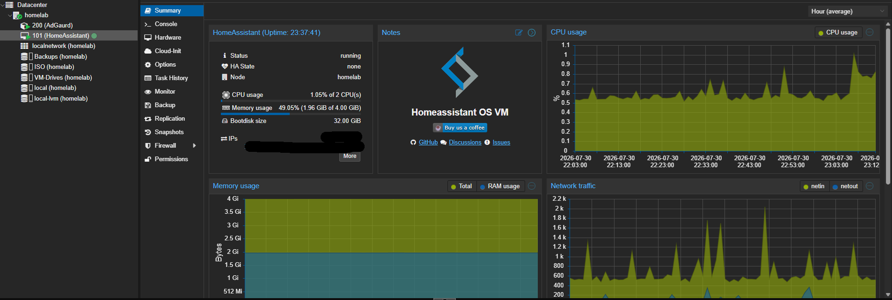

# Proxmox Cybersecurity Homelab

This section documents the systems I run in my Proxmox environment and the practical work I use them for.

The lab started with services such as Home Assistant and AdGuard Home, then grew into a small enterprise-style environment where I can practise networking, Windows administration, Linux, Active Directory and security monitoring.



## Current Lab

```text
                         Internet
                            |
                            ▼
                     +-------------+
                     |  OPNsense   |
                     | Firewall /  |
                     |   Router    |
                     +------+------+
                            |
                       Lab Network
                            |
         +------------------+------------------+
         |                  |                  |
         ▼                  ▼                  ▼
   +-----------+      +-----------+      +-----------+
   | Windows   |      | Windows   |      | Ubuntu    |
   | Server    |      | 11 Client |      | Server    |
   |  DC01     |      | WIN11-01  |      | Endpoint  |
   +-----+-----+      +-----+-----+      +-----+-----+
         |                  |                  |
         |      aireslab.test domain           |
         |                  |                  |
         +------------------+------------------+
                            |
                            ▼
                       +---------+
                       |  Wazuh  |
                       |  SIEM   |
                       +---------+
```

I do not publish real internal addressing, credentials or other sensitive configuration details. Any network addresses shown in individual project pages are examples only.

## Projects

### Security & Infrastructure

- [OPNsense Firewall & Lab Networking](./opnsense.md)
- [Windows Server & Active Directory](./active-directory.md)
- [Windows 11 Domain Client](./windows-11-client.md)
- [Ubuntu Server Endpoint](./ubuntu-server.md)
- [Wazuh SIEM & Endpoint Monitoring](./wazuh-siem.md)
- [Detections & Investigations](./Detections/): specific security events I generated and investigated, not just infrastructure

### Services

- [AdGuard Home - DNS Filtering](./adguard-home.md)
- [Home Assistant OS - Smart Home & Voice Automation](./home-assistant.md)

### Troubleshooting

- [Wazuh Manager Startup Timeout](./wazuh-startup-timeout.md): the SIEM stopped running on 25 August and nothing told me for nine days
- [Windows 11 VM Lag and RDP Through OPNsense](./win11-lag-and-rdp.md): a slow VM, a metric that was not measuring what I thought, and one controlled way into a segmented lab

## What I Use the Lab For

- Windows Server administration
- Active Directory and domain authentication
- DNS troubleshooting
- Windows and Linux endpoint administration
- Firewalling and routing
- Virtualization with Proxmox VE
- Centralized log collection
- SIEM monitoring and alert investigation
- Testing failed logons and other security events
- Troubleshooting connectivity, authentication and agent issues

## Status

**Status: Active / Work in Progress**

I continue to expand the environment as I learn. The goal is not to create a perfect production network, but to build enough real infrastructure that I can practise the same types of troubleshooting and security tasks I would encounter in an IT or SOC environment.
