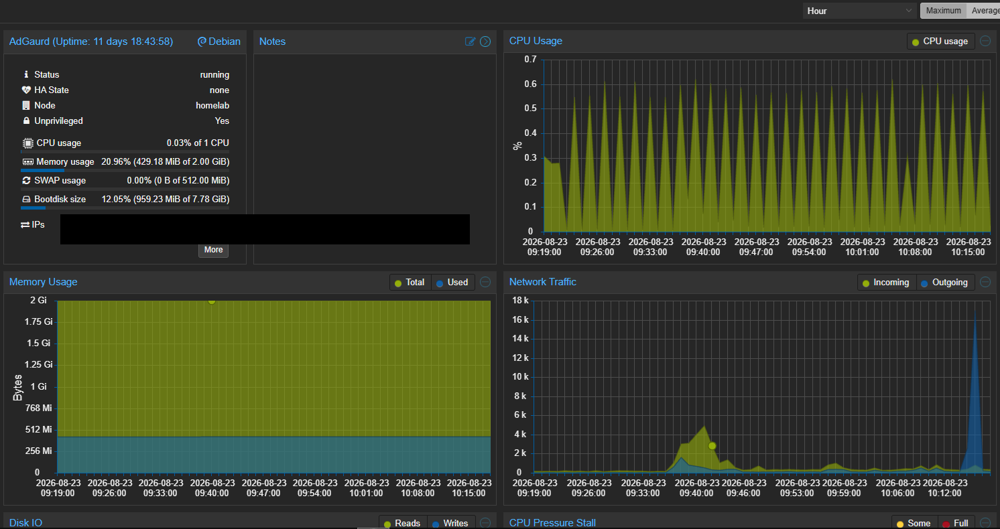
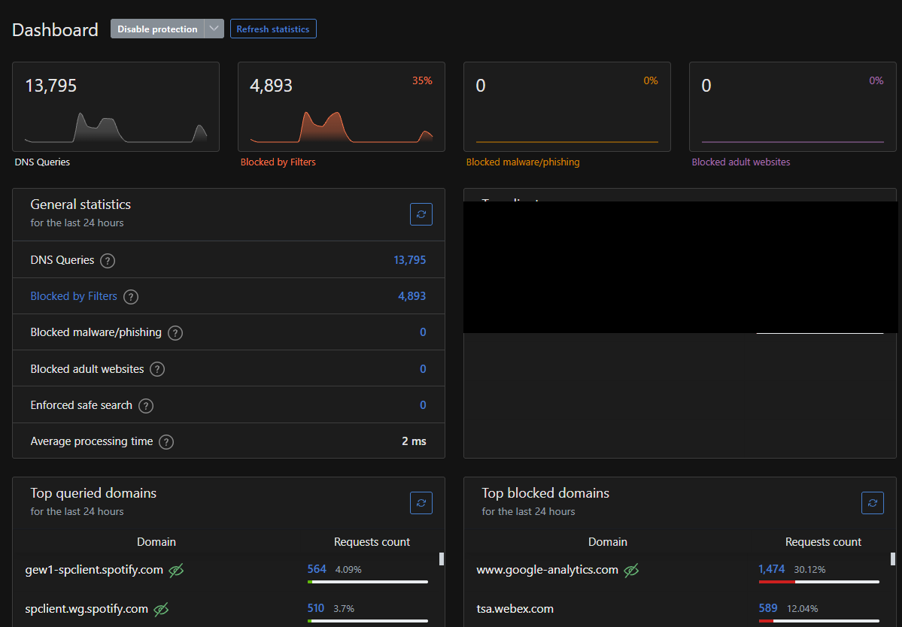
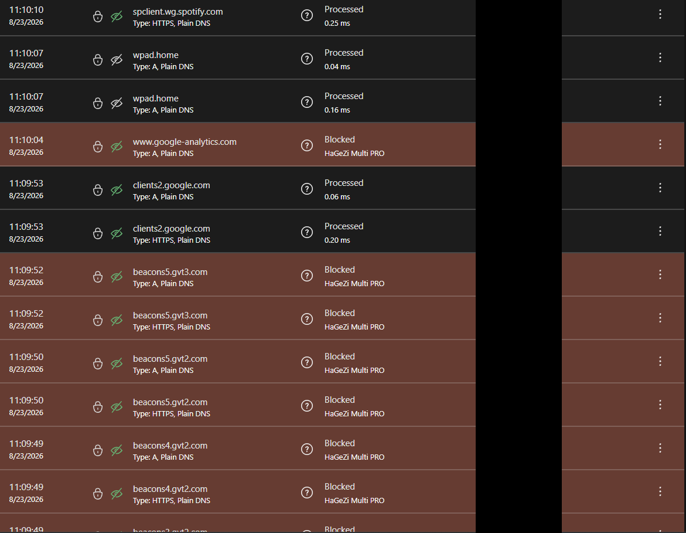

# AdGuard Home – DNS Filtering in My Proxmox Homelab

## Overview

I run AdGuard Home in my Proxmox homelab to provide DNS-based advertisement and tracker blocking for selected devices on my home network.

Rather than relying only on browser extensions or installing separate ad-blocking applications on every device, AdGuard Home gives me a central place to manage DNS filtering, blocklists, allowlists and DNS query activity.

My current router does not allow me to configure a custom DNS server for the entire network. Because of this limitation, I manually configure supported devices to use my AdGuard Home server for DNS.

Devices currently using AdGuard include:

- Desktop PC
- Laptop
- Tablet
- Smartphones

This is not just a temporary lab deployment. AdGuard Home is a service that I actively use on my home network.

---

## Environment

AdGuard Home runs inside an LXC container on my Proxmox VE server.

| Component | Configuration |
|---|---|
| Hypervisor | Proxmox VE |
| Service | AdGuard Home |
| Deployment | LXC Container |
| Container ID | 200 |
| Purpose | DNS filtering |
| Filtering | Advertisements, trackers and unwanted domains |
| Clients | Selected PCs, laptops, tablets and smartphones |
| Network | Home LAN |
| Status | Active |

I chose an LXC container because AdGuard Home has relatively low resource requirements and does not require a complete dedicated virtual machine for my use case.

---

## Why I Built This

I originally deployed AdGuard Home because I wanted advertisement and tracker blocking across multiple devices rather than only inside a web browser.

Browser extensions work well on computers, but many mobile applications and other devices do not support them.

Using DNS-based filtering gives me another layer of control.

AdGuard Home provides me with:

- Centralized DNS filtering
- Advertisement blocking
- Tracker and telemetry domain blocking
- Filtering for mobile applications
- Centralized blocklist management
- Custom allow and block rules
- DNS query visibility
- Per-client activity
- A better understanding of DNS behaviour

Running the service myself has helped me understand DNS from a practical perspective rather than only learning the theory.

---

# Current Network Limitation

One of the main limitations I encountered was my router.

My current router does not allow me to define a custom DNS server that can automatically be distributed to devices on the network.

Ideally, I would configure AdGuard Home at the router or DHCP level so that clients automatically receive it as their DNS server.

Because my router does not support this configuration, I created a workaround.

I manually configure supported devices to use AdGuard Home.

This means:

- Selected devices use AdGuard Home.
- Devices must currently be configured individually.
- Other devices continue using the DNS configuration provided by the router.
- AdGuard Home does not automatically filter every device on the LAN.

Although this is not my preferred final architecture, it allows me to use and learn from AdGuard Home without replacing my existing router.

---

# Current DNS Architecture

My current setup works approximately like this:

```text
                         HOME NETWORK

        Desktop PC ────────────┐
        Laptop ────────────────┤
        Tablet ────────────────┤
        Smartphones ───────────┤
                              │
                              │ Manually configured DNS
                              │
                              ▼
                    +-------------------+
                    |   AdGuard Home    |
                    |                   |
                    |   Proxmox LXC     |
                    |   Container 200   |
                    +---------+---------+
                              |
                              |
                        DNS Filtering
                              |
                              ▼
                        Upstream DNS
                              |
                              ▼
                           Internet


        Other Home Devices
                |
                |
                ▼
              Router
                |
                ▼
        Default Router DNS
                |
                ▼
             Internet
```

Only devices that I explicitly configure to use AdGuard send their DNS requests through the filtering service.

---

# Client DNS Configuration

Because my router cannot automatically distribute AdGuard Home as the DNS server, I configure DNS manually on supported devices.

My general configuration process is:

1. Identify the local address of the AdGuard Home server.
2. Open the network settings on the client device.
3. Change the DNS configuration from automatic to manual.
4. Configure the AdGuard Home server as the DNS resolver.
5. Save the configuration.
6. Generate a DNS request from the device.
7. Open the AdGuard Home query log.
8. Verify that the client's DNS request appears.
9. Confirm that filtering is functioning correctly.

For privacy and security reasons, I do not publish the real addressing of my home network in this repository.

Any addresses shown in documentation are examples only.

Example:

```text
AdGuard Home: 192.168.10.10
Client:       192.168.10.50
Network:      192.168.10.0/24
```

These addresses do not represent my actual home network.

---

# How DNS Filtering Works

When one of my configured devices wants to access a domain, it first asks AdGuard Home to resolve it.

The process is approximately:

```text
Client
  |
  | DNS Request
  ▼
+----------------+
| AdGuard Home   |
+-------+--------+
        |
        ▼
 Check Filtering
      Rules
        |
    +---+---+
    |       |
    ▼       ▼
 BLOCK    ALLOW
    |       |
    X       ▼
         Upstream
           DNS
            |
            ▼
         Internet
```

If the requested domain matches a filtering rule or blocklist, AdGuard Home blocks the DNS request.

If the domain is allowed, AdGuard forwards the request to the configured upstream DNS resolver.

---

# DNS Query Monitoring

One of the features I find most useful is the AdGuard Home query log.

It allows me to see DNS requests generated by devices using the service.

I can review information such as:

- Requested domains
- Allowed DNS requests
- Blocked DNS requests
- Client activity
- Frequently requested domains
- Filtering rules responsible for blocking a request
- Background requests generated by applications

This has shown me that devices and applications can generate a significant amount of network activity even when I am not actively interacting with them.

It has also helped me understand how DNS logs can be useful for both troubleshooting and security monitoring.

---

# Filtering and Blocklists

AdGuard Home uses DNS filtering lists and custom rules to determine whether requests should be allowed or blocked.

The basic process is:

```text
              DNS Request
                   |
                   ▼
            +--------------+
            | AdGuard Home |
            +------+-------+
                   |
                   ▼
           Filtering Rules
                   |
              +----+----+
              |         |
              ▼         ▼
            BLOCK      ALLOW
              |         |
              X         ▼
                    Upstream DNS
                         |
                         ▼
                      Internet
```

I can also create custom rules when needed.

For example:

- A legitimate service can be added to an allowlist if a required domain is incorrectly blocked.
- A specific unwanted domain can be manually blocked.
- Filtering behaviour can be tested using the query log.

I try to avoid adding allow rules without first understanding why the domain is required.

---

# Troubleshooting Methodology

DNS filtering can occasionally cause legitimate websites or applications to stop functioning correctly.

Instead of immediately disabling AdGuard Home, I try to troubleshoot the problem systematically.

My typical process is:

1. Determine whether the issue affects one device or several devices.
2. Verify normal network connectivity.
3. Confirm that the affected device is using AdGuard Home for DNS.
4. Open the AdGuard Home query log.
5. Reproduce the problem.
6. Look for DNS requests that were blocked at approximately the same time.
7. Identify the blocked domain.
8. Determine which filtering rule or blocklist caused the block.
9. Temporarily allow the domain if it appears legitimate.
10. Test the application or website again.
11. Create a permanent allow rule only if necessary.

This has given me practical experience troubleshooting the relationship between:

- DNS
- Network connectivity
- Applications
- Third-party services
- Tracking services
- Content delivery networks
- Filtering rules

---

# Example Troubleshooting Workflow

A simplified troubleshooting scenario could look like this:

```text
Application fails to load
          |
          ▼
Check network connectivity
          |
          ▼
Internet connection works
          |
          ▼
Check DNS configuration
          |
          ▼
Device is using AdGuard
          |
          ▼
Open AdGuard query log
          |
          ▼
Reproduce the problem
          |
          ▼
Required domain is blocked
          |
          ▼
Identify filtering rule
          |
          ▼
Temporarily allow domain
          |
          ▼
Retest application
          |
          ▼
Application works
          |
          ▼
Create permanent rule
only if justified
```

The goal is not only to make the application work again, but to understand what caused the problem.

---

# Security and Privacy Considerations

Because AdGuard Home handles DNS traffic for several of my devices, I treat it as part of my network infrastructure.

Some of the practices I follow include:

- Keeping AdGuard Home updated
- Keeping the underlying LXC environment updated
- Restricting the administration interface to my local network
- Not exposing the management interface directly to the Internet
- Backing up configuration before major changes
- Reviewing unexpected DNS activity
- Avoiding unnecessary allowlist rules
- Monitoring filtering behaviour when applications stop functioning

When publishing documentation or screenshots, I avoid exposing:

- Public IP addresses
- Internal IP addresses where unnecessary
- Personal device names
- Device identifiers
- Credentials
- Administrative usernames
- Private DNS query history
- Personal domains
- Authentication information

---

# Proxmox Integration

AdGuard Home runs as LXC container `200` on my Proxmox VE host.

Using Proxmox allows me to manage the service independently from the physical server.

I can:

- Allocate dedicated resources
- Start and stop the container
- Monitor CPU usage
- Monitor memory usage
- Manage storage
- Create backups
- Restore the container
- Access the console
- Manage networking
- Keep the service separated from other workloads

Running AdGuard Home this way has helped me gain experience with both Proxmox and Linux containers while running a service that I actually use.

---

# Why I Chose an LXC Container

I chose an LXC container rather than a full virtual machine because AdGuard Home is lightweight and does not require an entire dedicated VM for my environment.

Benefits include:

- Lower memory requirements
- Lower storage requirements
- Fast startup
- Efficient resource usage
- Easy backup and recovery
- Simple Proxmox integration

My homelab uses both virtual machines and containers, which also allows me to gain experience with the differences between the two approaches.

---

# Backup and Recovery

Because AdGuard Home provides DNS services to multiple devices, I want to be able to recover the service if the container fails or if I make an incorrect configuration change.

My backup approach includes:

- Proxmox LXC backups
- AdGuard Home configuration backups where appropriate
- Backing up before major configuration changes
- Keeping important backups separate from the running service when possible

A basic recovery process would be:

```text
Service Failure
      |
      ▼
Identify Problem
      |
      ▼
Attempt Normal Recovery
      |
      ▼
Recovery unsuccessful?
      |
      ▼
Restore Proxmox
LXC Backup
      |
      ▼
Start AdGuard Home
      |
      ▼
Test DNS Resolution
      |
      ▼
Test Filtering
      |
      ▼
Verify Client Connectivity
```

---

# What I Have Learned

Building and maintaining AdGuard Home has helped me develop practical experience with:

- DNS resolution
- DNS filtering
- Networking fundamentals
- Proxmox VE
- Linux containers
- LXC management
- Client/server communication
- Network troubleshooting
- Blocklists
- Allowlists
- DNS query analysis
- Service administration
- Backup and recovery
- Security considerations for network services

One of the biggest things I have learned is that DNS is much more than simply translating domain names into IP addresses.

DNS activity can provide useful visibility into how systems and applications communicate.

---

# Current Limitation vs Future Design

My current configuration works, but manually configuring each client is not the architecture I ultimately want.

## Current Design

```text
Selected Device
      |
      |
Manual DNS
Configuration
      |
      ▼
+--------------+
| AdGuard Home |
+------+-------+
       |
       ▼
  Upstream DNS
```

## Future Design

My goal is to eventually introduce a firewall/router such as pfSense and manage DNS centrally.

```text
                         Internet
                            |
                            ▼
                     +-------------+
                     |   pfSense   |
                     |  Firewall   |
                     +------+------+
                            |
                        DHCP / DNS
                            |
            +---------------+---------------+
            |               |               |
            ▼               ▼               ▼
        Client VLAN     Server VLAN       IoT VLAN
            |               |               |
            +---------------+---------------+
                            |
                            ▼
                     +--------------+
                     | AdGuard Home |
                     +------+-------+
                            |
                            ▼
                       Upstream DNS
```

This would allow DNS configuration to be automatically distributed through DHCP instead of configuring devices manually.

It would also allow me to begin experimenting with different policies for different network segments.

---

# Future Improvements

As I continue developing the homelab, I plan to improve this project with:

- pfSense integration
- Centralized DHCP
- Automatic DNS assignment
- VLANs
- Network segmentation
- Separate client network
- Separate server network
- Separate IoT network
- Different DNS policies between network segments
- Improved DNS logging
- Centralized security monitoring
- Security alerting
- DNS investigation exercises

---

# Future Cybersecurity Integration

My longer-term goal is to expand the Proxmox environment into a more security-focused homelab.

The planned environment will gradually include:

```text
Windows Server
      |
      ▼
Active Directory
      |
      ▼
Windows Clients
      |
      ▼
Sysmon
      |
      ▼
Centralized Logging
      |
      ▼
Wazuh SIEM
      |
      ▼
Security Monitoring
      |
      ▼
Incident Response
Exercises
```

DNS monitoring can also become useful during future security investigations.

Examples of things I would like to investigate in the lab include:

- Suspicious DNS requests
- Connections to unusual domains
- Repeated requests to suspicious infrastructure
- DNS activity from compromised endpoints
- Potential command-and-control activity
- Abnormal DNS behaviour

Any security testing or attack simulation will be performed only inside my own controlled homelab environment.

---

# Screenshots

## AdGuard Home in Proxmox

A sanitized screenshot of the Proxmox environment can be included here to demonstrate the running AdGuard LXC container.

```text
screenshots/adguard-proxmox.png
```

Markdown:

```markdown

```

---

## AdGuard Home Dashboard

A sanitized screenshot of the AdGuard Home dashboard can be added to show DNS activity and filtering statistics.

```text
screenshots/adguard-dashboard.png
```

Markdown:

```markdown

```

---

## DNS Query Log

A sanitized query-log screenshot can demonstrate how I use AdGuard Home to investigate DNS activity and troubleshoot blocked services.

```text
screenshots/adguard-query-log.png
```

Markdown:

```markdown

```

Before publishing screenshots, I remove or hide:

- Client IP addresses
- Device names
- Personal information
- Administrative usernames
- Private domains
- DNS history that could reveal personal activity

---

# Project Status

**Status: Active**

AdGuard Home is currently running continuously inside my Proxmox homelab.

It provides DNS filtering for selected everyday devices that I have manually configured to use it.

The project started primarily as a way to provide network-level advertisement and tracker filtering, but it has also become a useful way for me to learn more about DNS, networking, troubleshooting, Linux containers and network security.

As my homelab grows, I plan to evolve this configuration into a more centralized and segmented network architecture.

---

# Skills Demonstrated

This project has given me hands-on experience with:

- Proxmox VE
- LXC containers
- AdGuard Home
- DNS
- DNS filtering
- Linux-based services
- Networking
- Client DNS configuration
- Troubleshooting
- DNS query analysis
- Service administration
- Backup and recovery
- Security and privacy considerations
- Technical documentation

---

# Related CyberPath Projects

This project is part of my wider cybersecurity and infrastructure learning journey.

Current and planned projects include:

- Proxmox virtualization
- AdGuard Home
- Home Assistant
- Windows Server
- Active Directory
- Windows clients
- Sysmon
- Wazuh SIEM
- pfSense
- VLAN segmentation
- Security monitoring
- Incident response exercises

[← Return to CyberPath](https://github.com/RAires1/CyberPath)
