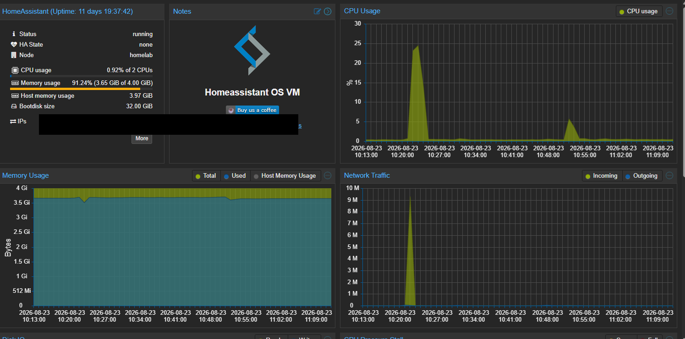
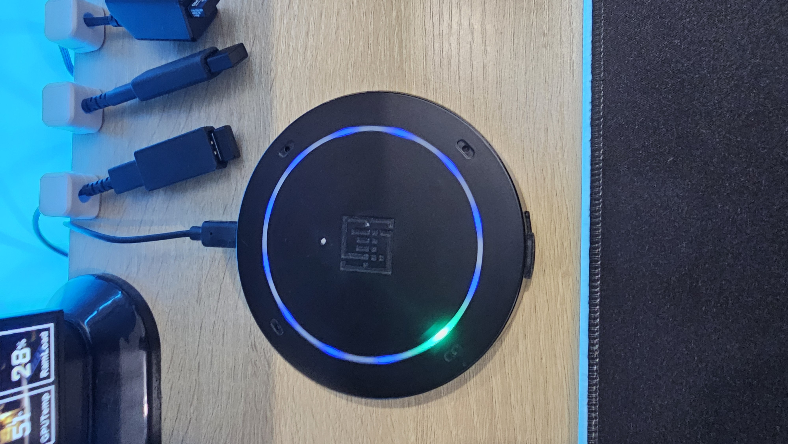

# Home Assistant OS – Smart Home & Voice Automation in My Proxmox Homelab

## Overview

I run **Home Assistant OS** as a dedicated virtual machine inside my Proxmox VE homelab.

Home Assistant is one of the main continuously running services in my environment and gives me a centralized platform for managing and automating smart-home devices.

My setup goes beyond simply hosting Home Assistant in a VM.

I have also integrated a **ReSpeaker XMOS XVF3800 4-Microphone Array** for far-field voice interaction, which I use with Home Assistant to control devices in my office, including:

- Govee desk lighting
- Office ceiling lights

This project brings together several areas I am interested in:

- Virtualization
- Networking
- Voice assistants
- Smart-home automation
- Hardware/software integration
- Service availability
- Troubleshooting
- Backup and recovery
- Infrastructure administration

It is also a real system that I use regularly rather than a temporary training deployment.

---

# Environment

Home Assistant OS runs as a full virtual machine on my Proxmox VE server.

| Component | Configuration |
|---|---|
| Hypervisor | Proxmox VE |
| Service | Home Assistant |
| Operating System | Home Assistant OS |
| Deployment | Virtual Machine |
| VM ID | 101 |
| VM Name | HomeAssistant |
| vCPU | 2 |
| Memory | 4 GiB |
| Boot Disk | 32 GiB |
| Network | Home LAN |
| Status | Active |

Home Assistant runs continuously alongside other services in my Proxmox environment.

---

# Why I Run Home Assistant in Proxmox

Running Home Assistant inside Proxmox allows me to use one physical server for several independent services.

My current environment includes:

```text
                 +----------------------+
                 |      Proxmox VE      |
                 |      Homelab Host    |
                 +----------+-----------+
                            |
              +-------------+-------------+
              |                           |
              ▼                           ▼
      +---------------+           +---------------+
      | VM 101        |           | LXC 200       |
      | HomeAssistant |           | AdGuard Home  |
      |               |           |               |
      | Home Assistant|           | DNS Filtering |
      | OS            |           |               |
      +---------------+           +---------------+
```

This allows Home Assistant and AdGuard Home to remain separate while sharing the same physical infrastructure.

---

# Why I Chose a Virtual Machine

I run Home Assistant OS as a full virtual machine rather than as an LXC container.

This gives Home Assistant its own isolated operating-system environment.

Benefits include:

- Dedicated virtual hardware
- Clear separation from the Proxmox host
- Independent operating-system environment
- Easy resource allocation
- VM-level backup and recovery
- Straightforward troubleshooting
- Isolation from other homelab services

My homelab currently gives me experience with both virtualization approaches:

| Service | Deployment |
|---|---|
| Home Assistant | Virtual Machine |
| AdGuard Home | LXC Container |

This has helped me understand the practical differences between running a complete virtual machine and a lightweight container.

---

# VM Resource Allocation

My current Home Assistant VM configuration is:

```text
VM ID:       101
Name:        HomeAssistant
vCPU:        2
Memory:      4 GiB
Boot Disk:   32 GiB
```

Through Proxmox I can monitor:

- CPU usage
- Memory usage
- Network traffic
- VM uptime
- Disk allocation
- VM status
- Backup status

The resources can be increased later if the workload grows.

---

# Current Architecture

My current Home Assistant infrastructure looks approximately like this:

```text
                          Internet
                             |
                             ▼
                           Router
                             |
                             ▼
                          Home LAN
                             |
                             ▼
                     +---------------+
                     |  Proxmox VE   |
                     | Homelab Host  |
                     +-------+-------+
                             |
                  +----------+----------+
                  |                     |
                  ▼                     ▼
         +----------------+     +----------------+
         | VM 101         |     | LXC 200        |
         | HomeAssistant  |     | AdGuard Home   |
         |                |     |                |
         | Home Assistant |     | DNS Filtering  |
         | OS             |     |                |
         +----------------+     +----------------+
```

The environment is currently relatively simple, but I plan to expand it as I develop the security side of my homelab.

---

# Networking

Home Assistant communicates with my home network through a virtual network interface connected to the Proxmox networking environment.

The simplified path is:

```text
HomeAssistant VM
       |
       ▼
Virtual Network Interface
       |
       ▼
Proxmox Network Bridge
       |
       ▼
Physical Network Interface
       |
       ▼
Home LAN
```

This allows Home Assistant to communicate with compatible devices and services on the network.

For privacy and security reasons, I do not publish the real IP addressing of my home environment.

Any IP addresses used in documentation are examples only.

Example:

```text
Proxmox Host:    192.168.10.5
Home Assistant:  192.168.10.20
Network:         192.168.10.0/24
```

These addresses do not represent my actual home network.

---

# Voice Assistant Hardware Integration

As part of my Home Assistant environment, I use a **ReSpeaker XMOS XVF3800 AI-powered 4-microphone array** as dedicated voice-input hardware.

## Hardware

| Component | Configuration |
|---|---|
| Device | ReSpeaker XMOS XVF3800 |
| Microphones | 4-Microphone Array |
| Controller | ESP32-S3 |
| Purpose | Home Assistant voice input |
| Pickup | 360° far-field voice capture |
| Audio Processing | Acoustic Echo Cancellation |
| Connectivity | Wi-Fi / Bluetooth supported by the hardware |

The dedicated microphone array allows me to interact with the voice-assistant environment from across the room instead of having to speak directly into a laptop or phone microphone.

---

# Why I Added a Dedicated Microphone Array

I wanted the Home Assistant voice environment to function more like a dedicated smart-home assistant.

A basic microphone is useful for testing, but a microphone array designed for room use provides additional capabilities such as:

- Multiple microphones
- Far-field voice pickup
- 360° listening coverage
- Acoustic Echo Cancellation
- Better suitability for room-based interaction
- Dedicated hardware for voice input

Integrating the ReSpeaker also added another layer of hardware and software that I could configure and troubleshoot.

---

# Voice Assistant Architecture

At a high level, the voice workflow looks like this:

```text
                    User Voice
                        |
                        ▼
             +----------------------+
             | ReSpeaker XVF3800    |
             | 4-Microphone Array   |
             +----------+-----------+
                        |
                        ▼
                  Voice Input
                        |
                        ▼
             +----------------------+
             |   Home Assistant     |
             |      VM 101          |
             +----------+-----------+
                        |
                        ▼
                Voice Processing
                        |
                        ▼
                 Automation
                        |
                        ▼
               Smart-Home Action
```

The ReSpeaker provides the physical voice-input layer while Home Assistant handles the automation and device-control side of the workflow.

---

# Voice-Controlled Office Lighting

I currently use Home Assistant and the ReSpeaker microphone array to control lighting in my office.

The devices include:

- **Govee desk lighting**
- **Office ceiling lights**

This gives the voice-assistant setup a practical everyday use rather than making it only a laboratory experiment.

The complete workflow looks approximately like this:

```text
                        User
                         |
                  Voice Command
                         |
                         ▼
             +----------------------+
             | ReSpeaker XVF3800    |
             | 4-Microphone Array   |
             +----------+-----------+
                        |
                        ▼
                 Voice Processing
                        |
                        ▼
             +----------------------+
             |   Home Assistant     |
             |      VM 101          |
             +----------+-----------+
                        |
                   Automation
                        |
             +----------+----------+
             |                     |
             ▼                     ▼
       Govee Desk Light     Office Ceiling Lights
```

This connects physical voice input to software processing and ultimately to real physical devices.

---

# Why I Integrated Lighting Control

One of my goals with Home Assistant was to create automations that I would actually use.

Lighting was a useful starting point because it connects several technologies together:

```text
Voice
  |
  ▼
Microphone Hardware
  |
  ▼
Voice Processing
  |
  ▼
Home Assistant
  |
  ▼
Automation Logic
  |
  ▼
Network Communication
  |
  ▼
Physical Smart Device
```

Instead of opening an application or dashboard each time, I can use voice interaction to control the lighting in my office.

This gave me practical experience connecting:

- Physical hardware
- Network services
- Virtualized infrastructure
- Voice processing
- Automation logic
- Smart devices

---

# Complete Office Automation Architecture

```text
                           OFFICE

                            User
                             |
                       Voice Command
                             |
                             ▼
                +----------------------+
                | ReSpeaker XVF3800    |
                | 4-Microphone Array   |
                +----------+-----------+
                           |
                           ▼
                      Home Network
                           |
                           ▼
                +----------------------+
                |     Proxmox VE       |
                |     Homelab Host     |
                +----------+-----------+
                           |
                           ▼
                +----------------------+
                | VM 101               |
                | HomeAssistant        |
                | Home Assistant OS    |
                +----------+-----------+
                           |
                       Automation
                           |
                +----------+----------+
                |                     |
                ▼                     ▼
         Govee Desk Light      Office Ceiling Lights
```

This is one of the areas of my homelab where virtualization, networking, physical hardware and automation all work together as one system.

---

# Far-Field Voice Challenges

Voice interaction introduces a different set of challenges compared with controlling devices from a dashboard.

A room-based microphone may need to deal with:

- Distance from the user
- Different speaking directions
- Background noise
- Speaker output
- Echo
- Different voice volumes

The ReSpeaker microphone array is designed for this type of environment.

Acoustic Echo Cancellation is particularly useful in systems where a device may need to capture voice while audio is also present in the room.

---

# Troubleshooting the Voice Pipeline

When a voice command does not work correctly, there are several possible layers where the problem could exist.

Instead of assuming the issue is inside Home Assistant, I can work through the pipeline step by step.

```text
Voice command fails
        |
        ▼
Is microphone receiving audio?
        |
        ▼
Is voice input reaching the system?
        |
        ▼
Is speech being processed?
        |
        ▼
Is the command recognized?
        |
        ▼
Is Home Assistant receiving the command?
        |
        ▼
Is the automation triggered?
        |
        ▼
Is the target device reachable?
        |
        ▼
Does the physical device respond?
```

Potential problem areas include:

- Microphone hardware
- Audio capture
- Voice processing
- Network connectivity
- Home Assistant
- Automation configuration
- Smart-device availability

This layered troubleshooting method helps me isolate problems instead of changing several components at once.

---

# Infrastructure Troubleshooting

I use a similar layered approach when troubleshooting Home Assistant itself.

```text
Application
     |
     ▼
Home Assistant OS
     |
     ▼
Virtual Machine
     |
     ▼
Proxmox
     |
     ▼
Virtual Networking
     |
     ▼
Physical Network
     |
     ▼
Hardware
```

For example, if I cannot access Home Assistant, I can check:

1. Is the Proxmox host online?
2. Is VM 101 running?
3. Is CPU and memory usage normal?
4. Does the VM have network connectivity?
5. Is Home Assistant itself running?
6. Was a recent configuration change made?
7. Are the smart devices reachable?

This helps me understand where the problem originates before making changes.

---

# Example Troubleshooting Workflow

```text
Cannot access Home Assistant
          |
          ▼
Check Proxmox host
          |
          ▼
Host online?
          |
          ▼
Check VM 101
          |
          ▼
VM running?
          |
          ▼
Check network connectivity
          |
          ▼
Network available?
     |
 +---+---+
 |       |
No      Yes
 |       |
 ▼       ▼
Check   Check Home
network Assistant
bridge  service
```

The goal is to isolate the affected layer before attempting a fix.

---

# Monitoring Through Proxmox

Proxmox gives me infrastructure-level visibility into the Home Assistant VM.

I can monitor:

- VM status
- CPU usage
- Memory usage
- Network traffic
- Storage allocation
- Uptime
- Backup status
- VM configuration

A simplified monitoring relationship is:

```text
               Proxmox VE
                   |
                   ▼
          +------------------+
          | HomeAssistant VM |
          +------------------+
                   |
          +--------+--------+
          |        |        |
          ▼        ▼        ▼
         CPU      RAM     Network
         Usage    Usage    Traffic
```

This allows me to distinguish between problems affecting the application and problems affecting the underlying VM or infrastructure.

---

# Service Availability

Home Assistant is a service I want to remain continuously available.

I therefore treat it differently from temporary lab VMs that can be created or destroyed without affecting anything.

Before major changes I consider:

- Whether Home Assistant will become unavailable
- Whether the VM should be shut down cleanly
- Whether a current backup exists
- Whether networking changes may affect the VM
- Whether storage changes may affect the VM
- Whether Home Assistant configuration should also be backed up

Running a service that I actually use has helped me understand the importance of planning changes rather than treating every VM as disposable.

---

# Backup Strategy

I use more than one level of backup for Home Assistant.

## Home Assistant Backup

Home Assistant provides its own backup functionality.

This allows the application configuration and environment to be backed up from inside Home Assistant.

## Proxmox VM Backup

I can also create a full backup of the Home Assistant virtual machine through Proxmox.

This provides a second recovery option at the infrastructure level.

```text
              Home Assistant
                    |
                    ▼
          Application Backup


               Proxmox VE
                    |
                    ▼
             Full VM Backup
                    |
                    ▼
           HomeAssistant VM
```

Using both application-level and VM-level backups gives me different recovery options depending on the type of failure.

---

# Backup Before Major Changes

Before making significant infrastructure changes, I prefer to verify that I have a recoverable backup.

My general workflow is:

```text
Planned Change
      |
      ▼
Create Home Assistant Backup
      |
      ▼
Create Proxmox VM Backup
      |
      ▼
Verify Backup
      |
      ▼
Perform Change
      |
      ▼
Start / Verify VM
      |
      ▼
Verify Home Assistant
      |
      ▼
Verify Automations
```

Examples of changes where I would want a backup include:

- Migrating to different hardware
- Changing storage configuration
- Modifying Proxmox networking
- Reinstalling Proxmox
- Performing major Home Assistant changes

---

# Recovery Strategy

If normal troubleshooting cannot restore Home Assistant, backups provide a recovery path.

```text
Recovery Required
       |
       ▼
Identify Last Known-Good Backup
       |
       ▼
Restore VM / Configuration
       |
       ▼
Start Home Assistant
       |
       ▼
Verify Network Connectivity
       |
       ▼
Verify Home Assistant
       |
       ▼
Verify Automations
       |
       ▼
Confirm Normal Operation
```

The ability to recover a service is just as important to me as getting it working initially.

---

# Security and Privacy Considerations

Because Home Assistant interacts with devices on my home network, I treat it as an important internal service.

Some practices I follow include:

- Keeping Home Assistant updated
- Keeping Proxmox updated
- Avoiding unnecessary Internet exposure
- Protecting administrative access
- Creating backups
- Monitoring the VM
- Avoiding publishing unnecessary internal information

When creating public documentation or screenshots, I remove or hide:

- IP addresses
- Administrative usernames
- Credentials
- API keys
- Authentication tokens
- Internal URLs
- Personal device information
- Location information
- Sensitive automation details

I also avoid publishing a complete inventory of devices on my home network.

---

# What I Have Learned

Running Home Assistant inside my Proxmox homelab has given me practical experience with:

- Proxmox VE
- Virtual machines
- Home Assistant OS
- VM resource allocation
- Virtual networking
- Network-connected devices
- Infrastructure monitoring
- Backup and recovery
- Service troubleshooting
- Hardware/software integration
- Smart-home automation
- Microphone arrays
- Far-field audio
- Acoustic Echo Cancellation
- Voice-assistant architecture
- Service availability
- Technical documentation

It has also helped me understand that even a simple action such as turning on a light can depend on several different systems working correctly.

```text
User
 ↓
Microphone
 ↓
Voice Processing
 ↓
Network
 ↓
Home Assistant
 ↓
Automation
 ↓
Smart Device
```

A failure at any layer can affect the final result.

---

# Home Assistant and AdGuard

Home Assistant and AdGuard Home currently run independently on the same Proxmox host.

```text
                       Proxmox VE
                           |
                +----------+----------+
                |                     |
                ▼                     ▼
         HomeAssistant VM       AdGuard Home LXC
                |                     |
                ▼                     ▼
         Smart Home / Voice       DNS Filtering
          Automation
```

This also gives me experience with two different types of virtualization:

- Home Assistant → Full VM
- AdGuard Home → LXC container

---

# Future Improvements

I plan to continue developing the Home Assistant environment alongside the rest of my homelab.

Possible improvements include:

- Improved voice recognition
- Improved wake-word detection
- Faster voice response times
- Better microphone placement
- Local voice processing where practical
- More advanced automations
- Better monitoring
- Improved backup strategy
- pfSense integration
- Network segmentation
- Dedicated IoT VLAN
- More controlled communication between smart-home devices and other network segments

---

# Future Network Segmentation

As my networking lab develops, I would like to separate different categories of devices.

A possible future design is:

```text
                       Internet
                          |
                          ▼
                      pfSense
                          |
          +---------------+---------------+
          |               |               |
          ▼               ▼               ▼
     Client VLAN      Server VLAN       IoT VLAN
                          |               |
                          |               |
                          ▼               ▼
                     Proxmox         Smart Devices
                          |
                          ▼
                  HomeAssistant VM
```

This would allow me to learn more about:

- VLANs
- Firewall policies
- Network segmentation
- IoT security
- Inter-VLAN communication
- Access control between network segments

while continuing to use Home Assistant normally.

---

# Future Cybersecurity Homelab Integration

My longer-term goal is to expand Proxmox into a more security-focused environment while keeping my existing home services running.

The planned security lab will gradually include:

```text
                         Proxmox VE
                             |
        +--------------------+--------------------+
        |                    |                    |
        ▼                    ▼                    ▼
 Home Services         Enterprise Lab       Security Lab
        |                    |                    |
 Home Assistant        Windows Server          Wazuh
 AdGuard Home         Active Directory         Sysmon
 Voice Assistant      Windows Clients        Monitoring
                                            Security Labs
                                                |
                                                ▼
                                       Incident Response
                                          Exercises
```

This will allow me to maintain real home services while also building a dedicated environment for cybersecurity learning.

---

# Screenshots

## Home Assistant VM in Proxmox

A sanitized screenshot of the Home Assistant VM running in Proxmox can be added here.

Suggested file:

```text
screenshots/homeassistant-proxmox.png
```

Markdown:

```markdown

```

The screenshot can demonstrate:

- VM 101
- HomeAssistant VM name
- VM status
- CPU usage
- Memory usage
- Boot-disk allocation
- Network activity
- Proxmox monitoring

Before uploading screenshots, I remove or hide sensitive information such as IP addresses and administrative details.

---

## Voice Hardware

A photo of the ReSpeaker microphone array can also be included.

Suggested file:

```text
screenshots/respeaker-xvf3800.jpg
```

Markdown:

```markdown

```

---

## Office Lighting

A sanitized photo of the office lighting setup could also demonstrate the physical result of the automation.

Suggested file:

```text
screenshots/office-lighting.jpg
```

Markdown:

```markdown

```

---

# Project Status

**Status: Active**

Home Assistant OS currently runs continuously as VM `101` inside my Proxmox VE homelab.

The environment is actively used for smart-home automation and voice control.

My current voice setup uses a **ReSpeaker XMOS XVF3800 4-microphone array**, and I use Home Assistant to control devices including my **Govee desk lighting and office ceiling lights**.

This project started as a home-automation setup but has also become a practical way for me to learn about virtualization, networking, service administration, troubleshooting, voice assistants and hardware/software integration.

---

# Skills Demonstrated

This project has given me hands-on experience with:

- Proxmox VE
- Virtual machines
- Home Assistant OS
- Virtual networking
- VM resource management
- Infrastructure monitoring
- Backup and recovery
- Service troubleshooting
- Smart-home automation
- Voice-assistant integration
- ReSpeaker XVF3800
- Microphone arrays
- Far-field audio
- Acoustic Echo Cancellation
- Network-connected devices
- Hardware/software integration
- Infrastructure planning
- Security and privacy considerations
- Technical documentation

---

# Related CyberPath Projects

This project is part of my wider cybersecurity and infrastructure learning journey.

Current and planned projects include:

- Proxmox virtualization
- Home Assistant
- AdGuard Home
- Voice-assistant integration
- Windows Server
- Active Directory
- Windows clients
- Sysmon
- Wazuh SIEM
- pfSense
- VLAN segmentation
- IoT segmentation
- Security monitoring
- Incident response exercises

[← Return to CyberPath](https://github.com/RAires1/CyberPath)
