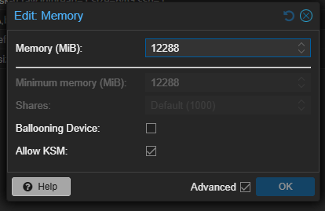
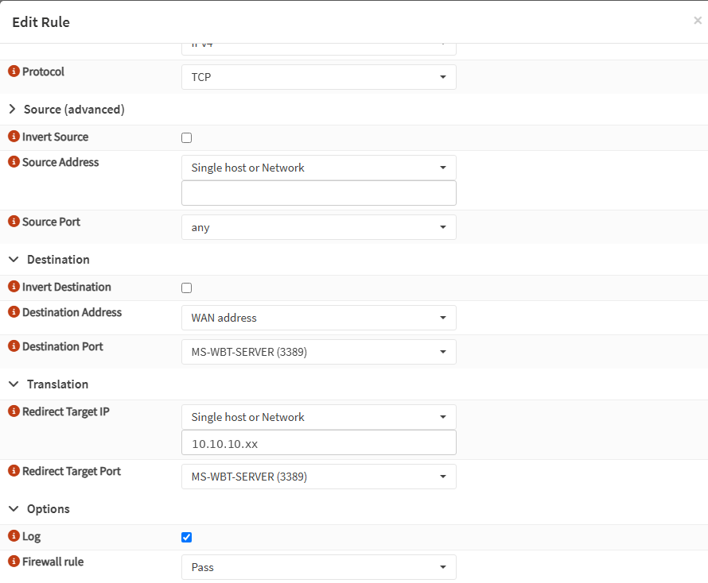
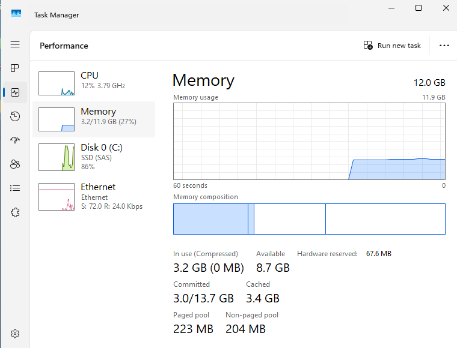
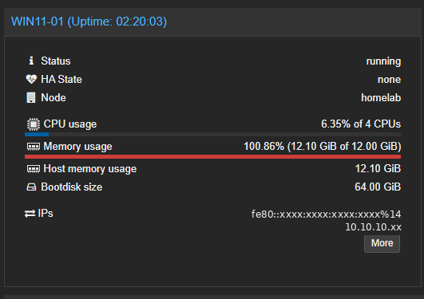
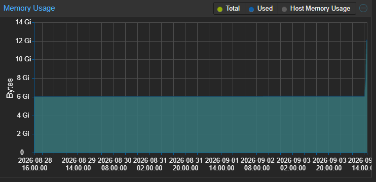

# Windows 11 VM Lag and Getting RDP Through OPNsense

**Date:** 2026-09
**Environment:** aireslab.test (Proxmox homelab)
**Area:** Virtualization performance, NAT and firewall rules, remote access

## Scenario

My Windows 11 VM was painful to work in. Windows was sluggish, typing lagged behind what I was doing, and switching windows took longer than it should. Every other VM on the server felt fine, so it was not the host.

Two things turned out to be wrong at the same time. The VM did not have enough RAM, and I was doing all of my work through the Proxmox web console, which adds overhead of its own. Fixing either one on its own would not have helped much.

I do not publish credentials or sensitive configuration. Host addresses below are masked and the subnets are from my own private lab ranges.

## Environment

| Component | Detail |
|---|---|
| Hypervisor | Proxmox VE |
| Host RAM | 64 GB, about 32 GB assigned across all VMs |
| Guest | Windows 11, domain-joined to aireslab.test |
| Guest RAM before | 6 GB |
| Lab network | 10.10.10.0/24 behind OPNsense |
| Home network | 192.168.1.0/24 behind the ISP router |
| Uplink | Server, Ethernet, Wi-Fi extender, ISP router |

## Part One: The Lag

### What I Checked

The VM summary page showed memory at 101%. The host looked fine at the same time, 32 GB assigned out of 64 GB with no swapping and no IO delay, so I decided the pressure was inside the guest and added memory.

The change worked. The reasoning behind it did not hold up, and I only worked out why afterwards. That is covered in What I Got Wrong below, because it matters more than the fix does.

### Cause

6 GB is not much for a domain-joined Windows 11 client. Windows now settles at about 3.2 GB of 12 doing the same work, so on 6 GB there was very little headroom left once Defender and the domain profile were loaded. That is consistent with the machine being slow, and with it becoming responsive as soon as the ceiling moved.

The console made it worse independently of the memory. noVNC re-encodes the whole framebuffer over the network, so scrolling and dragging windows feel bad even on a healthy VM.

### Fix

Raised the VM to 12 GB. The Ballooning Device was already unticked, which is why the minimum memory field is greyed out and sitting at the same value. That turned out to be the important part, though I did not know it at the time.



One thing caught me out here. Rebooting from inside Windows does not apply the new memory size. The QEMU process stays alive and the VM comes back with the old value. It needs a full shutdown and start from Proxmox.

The machine was responsive straight away, and Task Manager inside the guest now sits at about 3.2 GB of 12, with 8.7 GB available.

### The Disk That Was Not A Problem

After the resize, Task Manager showed the disk at 100% with response times swinging between 19 ms and 59 ms. It looked bad.

The host said otherwise. Total disk IO was peaking around 6 to 7 MB/s, which is nothing, and it was mostly reads that started right after the resize. That is Windows re-indexing and Defender rescanning after a significant change, not a storage bottleneck.

I checked the disk configuration anyway and it was already correct:

```text
scsi0: vm-drives:103/vm-103-disk-0.raw,iothread=1,size=64G,ssd=1
SCSI Controller: VirtIO SCSI single
Processors: 4 (host)
Machine: q35, OVMF (UEFI)
```

VirtIO SCSI with iothread and SSD emulation, CPU type host. Nothing to change, and the activity settled on its own.

Windows reporting 100% disk next to almost no throughput on the host usually means a lot of small operations rather than a saturated device. Worth checking both sides before changing anything.

## Part Two: RDP From My Home Network

Since the console was half the problem, the answer was to stop using it. The Windows VM sits on 10.10.10.0/24 behind OPNsense and my desktop is on 192.168.1.0/24. OPNsense NATs outbound so the lab can reach the internet, but nothing routes back the other way. That separation is the point of segmenting the lab, so I wanted one controlled way through it rather than flattening the network.

### The Option I Could Not Use

The clean way is a static route on the home router sending 10.10.10.0/24 to the OPNsense WAN address. My ISP router does not expose static routing at all on its residential firmware.

So destination NAT on OPNsense instead, which needs nothing from the ISP router.

### Checking Where OPNsense Actually Sat

The server reaches the ISP router through a Wi-Fi extender acting as a wireless bridge, and I wanted to be sure the extender was not adding a second layer of NAT. From the OPNsense shell:

```sh
ifconfig | grep "inet "
```

```text
inet 192.168.1.xx  netmask 0xffffff00  broadcast 192.168.1.255   # WAN
inet 10.10.10.1    netmask 0xffffff00  broadcast 10.10.10.255    # LAN
```

WAN was sitting directly on the home LAN, so the extender was bridging properly and that address was reachable from my desktop.

### Configuration

**Pinned the WAN address.** Interfaces, WAN, Static IPv4.

The gateway dropdown only lists gateway objects that already exist, and a DHCP-learned gateway is not one, so it showed nothing except "Disabled". The gateway has to be created first under System, Gateways, Configuration, and then it appears in the interface dropdown.

**Unticked "Block private networks" on WAN.** That setting drops all RFC1918 traffic arriving on the WAN interface, which is exactly what my desktop is. Nothing below this works until it is off.

**Added the port forward.** In current OPNsense this lives under Firewall, NAT, Destination NAT, not "Port Forward".

| Field | Value |
|---|---|
| Interface | WAN |
| Protocol | TCP |
| Destination address | WAN address |
| Destination port | MS-WBT-SERVER (3389) |
| Redirect target IP | 10.10.10.xx (the Windows client) |
| Redirect target port | MS-WBT-SERVER (3389) |
| Log | Enabled |
| Firewall rule | Pass |

That last field is the one that cost me time. Left on "Manual", OPNsense creates the translation but no matching pass rule, so the packet gets rewritten and then dropped by the default WAN block. The rule looks correct in the list and does nothing. "Pass" creates both.



### Two Errors On The Windows Side

**"Your credentials did not work."** RDP sends whatever credentials are cached on the client before it asks for anything. Mine was a personal Microsoft account, which means nothing to a domain-joined machine. Fixed by choosing "Use a different account" and entering the domain account as `AIRESLAB\<user>`.

**"The connection was denied because the user account is not authorized for remote login."** A different error, and actually progress, because authentication had succeeded and it was authorization that failed. On Windows 11 Pro only local Administrators and members of Remote Desktop Users can connect, and a domain user who signs in at the console is not automatically in either group.

```powershell
Add-LocalGroupMember -Group "Remote Desktop Users" -Member "AIRESLAB\<user>"
```

## Result

The VM went from unusable to feeling like a normal desktop. Windows sits at about 3.2 GB of 12, RDP works from my main machine across the segmented network, and the console is back to being used for what it is actually for, which is installs and rescue.

## What I Got Wrong

**I diagnosed from a number that was not measuring what I thought.** The 101% on the VM summary page looked like the guest running out of memory. It was not. Proxmox reads guest memory usage from the balloon device. With no balloon device attached there is nothing for it to read, so it falls back to reporting how much memory was assigned, and the figure sits at the ceiling permanently no matter what Windows is doing. I can see that plainly now. Task Manager reports 3.2 GB in use, 27% of the total. The Proxmox summary for the same machine at the same moment reports 100.86%, 12.10 GiB of 12.00 GiB.





The giveaway is one line further down the same panel. Host memory usage reads 12.10 GiB, the identical figure. Proxmox is showing what the QEMU process costs on the host, not what Windows is doing inside it, and because that process costs slightly more than the memory it hands to the guest, the percentage creeps past 100.

I checked both ends afterwards. The balloon device was not enabled on the VM, and the VirtIO balloon driver was never installed inside Windows either, so there were two separate reasons the hypervisor could not see what the guest was doing. Neither of them changed when I resized the VM, which is why the same misleading number is still on screen today.

The week of history before the change makes it obvious in hindsight. It is a flat line resting exactly on 6 GiB for seven days, and real memory usage does not behave like that. It moves. A perfectly straight line at the ceiling should have told me I was looking at an allocation, not a measurement.



So I got the right answer for the wrong reason. Adding memory was correct, and the evidence that actually supports it is Task Manager inside the guest plus the fact that the machine became responsive immediately. The hypervisor number I leaned on at the time contributed nothing.

**I chased the disk because Task Manager told me to,** when the host had already shown that the storage was doing almost nothing. The number that looked most alarming was the one that mattered least. Same mistake as the first one. I trusted the reading instead of asking what was producing it.

**I treated the two RDP errors as the same problem** and went back to check the firewall after the second one, when that second error was proof the firewall was already working.

## Lessons Learned

- Before acting on a metric, know what is producing it. A number can sit at the right layer and still not measure what it appears to. Proxmox showing 100% memory on a VM with no balloon device is reporting how much was assigned, not how much is used.
- A flat line is suspicious. Real usage fluctuates, so a metric that does not move is usually a configuration value being displayed rather than something being measured.
- A memory change on a Proxmox VM needs a stop and a start, not a reboot from inside the guest.
- Read authentication and authorization errors as different things. "Credentials did not work" and "not authorized for remote login" point at completely different fixes, and the second one means you got further than you were before.
- A NAT rule that creates no firewall rule is invisible when it fails. The translation happens and the packet is dropped afterwards, so the configuration looks correct while nothing works.

## Next Steps

- Install and enable the QEMU Guest Agent on this VM. Until that is in place the Proxmox memory reporting for it is not usable for anything, and I would rather have the graphs mean something before I need them again.
- Replace the port forward with WireGuard on OPNsense. Exposing 3389, even only on my own LAN, is not something I would do in production, and a VPN endpoint would give access to the whole lab subnet without a forward.
- Push RDP enablement through Group Policy (Allow log on through Remote Desktop Services) instead of setting it per machine.
- Manage Remote Desktop Users membership through Group Policy Restricted Groups.
- Watch free space on the 64 GB system disk, which is tight for a domain-joined Windows 11 client.
- Replace the Wi-Fi extender. All lab traffic crosses a wireless hop twice, and powerline or a cable run would remove it.
